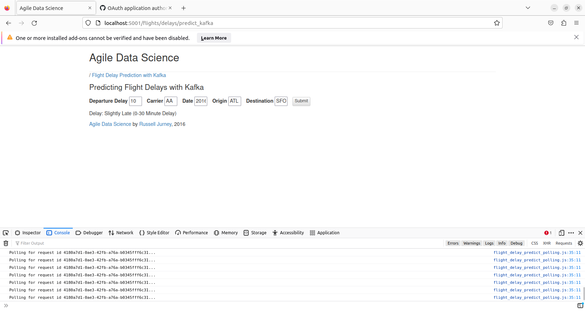
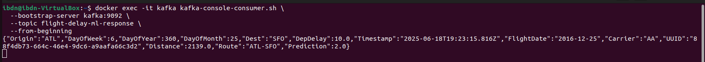

# Versión 2 - Vuelta por Kakfa

Se modifica el contenedor del servicio kafka para la creación del topic de respuestas `flight-delay-ml-response`, en el que Spark publica los resultados predichos desde `entrypoint`.

Para habilitar la publicación de mensajes en un nuevo topic de Kakfa, se ha modificado la clase `MakePrediction.java` y se ha recompilado el código desde el contenedor `spark_submit`.

# Resultado

A continuación, se muestra el resultado de la predicción en Flask: 

Y la evidencia de que ha sido almacenado en el nuevo topic

