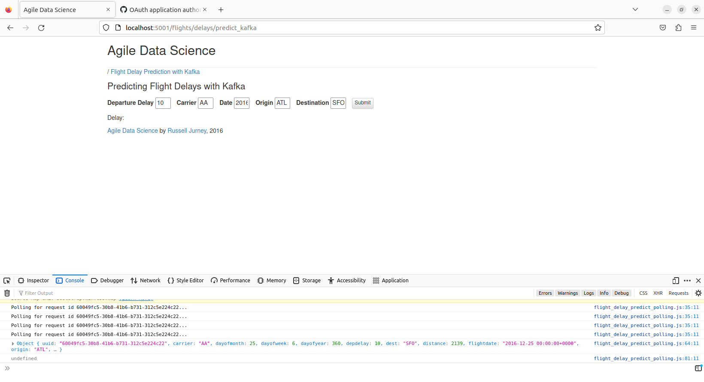
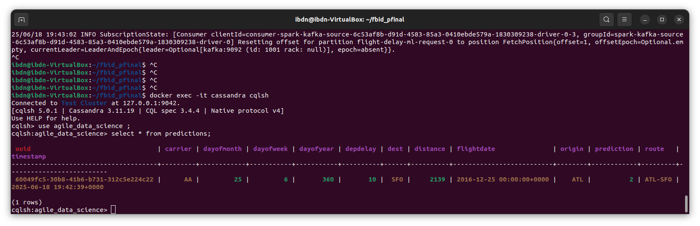

# Versión 3: Sustitución de MongoDB por Cassandra

Para sustituir MongoDB por Cassandra se elimino el servicio `mongodb`del `docker-compose.yml` y se definieron dos servicios nuevos: `cassandra`, que es el servicio de base de datos en sí, y `cassandra-seed` que constituye un servicio implementado únicamente para inicializar la base de datos de Cassandra.

Para ello, se transformaron los datos originales de distancias de formato `jsonl`a CSV mediante el script `jsonl_to_csv.py` y se crea la base de datos con la estructura necesaria a partir de `init.sh`

Se ha modificado el código de `MakePrediction.java` para conectarse a Cassandra y realizar la escritura de los datos en la colección `use_agile_data_science`, en la tabla `predictions`

Dado que Flask necesita realizar queries a Cassandra, se han modificado los endpoints necesarios en `predict_flask.py` para ajustar las consultas al nuevo sistema de bases de datos, teniendo en cuenta la estructura de las tablas. Además, también ha sido necesario modificar el poolling. 

# Resultados 

Evidencia de registro en Cassandra: 

